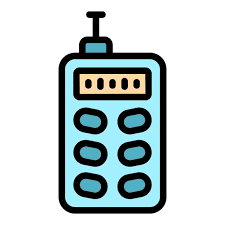

<!--
---

layout: home
permalink: index.html

# Please update this with your repository name and project title
repository-name: e21-3yp-Smart-Laser-Distance-Meter
title: Smart Laser Distance Meter
---
-->

# Smart Laser Distance Meter

<div align="left">
  
</div>

---

## Team
-  E/21/065, CHAMOD S.A.R., [email](mailto:e21065@eng.pdn.ac.lk)
-  E/21/068, CHANDRASIRI E.M.D.D.V, [email](mailto:e21068@eng.pdn.ac.lk)
-  E/21/277, PADUKKA V.K., [email](mailto:e21277@eng.pdn.ac.lk)
-  E/21/325, RASHMIKA W.B.R., [email](mailto:e21325@eng.pdn.ac.lk) 

<!-- Image (photo/drawing of the final hardware) should be here -->

<!-- This is a sample image, to show how to add images to your page. To learn more options, please refer [this](https://projects.ce.pdn.ac.lk/docs/faq/how-to-add-an-image/) -->

<!--  -->

## Table of Contents
1. [Introduction](#introduction)
2. [Project Overview (Non-Technical)](#project-overview-non-technical)
3. [Key Features](#key-features)
4. [Solution Architecture](#solution-architecture)
5. [Repository Structure](#repository-structure)
6. [Technology Stack](#technology-stack)
7. [Hardware & Software Designs](#hardware-and-software-designs)
8. [BLE Protocol (Device ↔ App)](#ble-protocol-device--app)
9. [Backend API (App ↔ Cloud)](#backend-api-app--cloud)
10. [Getting Started (Run Locally)](#getting-started-run-locally)
11. [Limitations & Roadmap](#limitations--roadmap)
12. [Links](#links)

## Introduction

Accurate indoor measurement and floor plan creation are essential in construction, interior design, and architectural planning. Traditional manual measuring methods are time-consuming, error-prone, and require manual sketching.  

This project proposes a Smart Laser Distance Meter that combines a handheld time-of-flight (ToF) distance meter with a mobile app to create room sketches and floor plans.

This repository contains:
- Firmware for an ESP32-based handheld device that measures distances and sends them over Bluetooth Low Energy (BLE)
- A Flutter mobile app (“SmartMeasure Pro”) for sketching rooms, AR-assisted scanning, exporting, and saving projects
- A Node.js + PostgreSQL backend for authentication, cloud sync, and collaboration

Note: The original concept includes IMU-based angle/orientation measurement. The current firmware in this repo focuses on ToF distance measurement + BLE transfer (IMU integration can be added as an extension).

## Project Overview (Non-Technical)

**What it is**: A “smart measuring tape” for rooms. You measure walls using a handheld laser/ToF device, and the phone app turns those measurements into a clean floor plan.

**Who it helps**:
- Architects, civil engineers, and survey/estimation workflows
- Interior designers and renovation planning
- Anyone needing quick indoor measurements and a shareable plan

**Typical user flow**:
1. Open the app and start a project
2. Connect to the handheld device via Bluetooth
3. Sketch the room outline (tap walls/points) and shoot real measurements to each wall
4. Add doors/windows and furniture
5. Export (PDF/DXF) or sync to cloud for backup and collaboration

## Key Features

### End-user features
- **Bluetooth-connected laser distance measurements** from the handheld device
- **Room sketching** (2D floor plan) with measured wall lengths
- **AR room scan** option (ARCore/ARKit) to generate a polygon-based floor plan
- **Projects**: save locally (SQLite) and restore later
- **Cloud sync** with login (JWT)
- **Collaboration** using invite codes and optional edit access
- **Exports**: PDF export and DXF (CAD) export + share

### Developer features
- Clean separation of concerns: `firmware/` (embedded), `code/` (Flutter app + backend)
- Offline-first sync queue on the app (uploads retry when connectivity returns)
- Conflict detection on cloud uploads (server `updated_at` vs client `last_modified_at`)
- Presence/active collaborator tracking (heartbeat + “active in last 2 minutes”)


## Solution Architecture

The system consists of a handheld embedded device and a mobile application. The embedded unit performs distance and orientation sensing, processes data using a microcontroller, and transmits results wirelessly to the mobile app.

**High-level data flow:**
- Handheld device measures distance (ToF)
- ESP32 sends measurements to the app via BLE notifications
- The mobile app applies measurements to walls/objects in the sketch
- Projects are saved locally (SQLite)
- Optional: app syncs to cloud backend (HTTPS + JWT) for backup/collaboration

```mermaid
flowchart LR
  Device[Handheld Device\nESP32 + ToF sensor] -- BLE notify --> App[Flutter App\nSmartMeasure Pro]
  App -->|Save locally| LocalDB[(SQLite)]
  App -->|Export| Export[PDF / DXF / Share]
  App -->|AR scan| AR[ARCore/ARKit]\n
  App -->|HTTPS + JWT| API[Node.js + Express API]
  API --> DB[(PostgreSQL)]
```

## Repository Structure

- `firmware/` — ESP32 firmware (PlatformIO/Arduino)
  - `firmware/src/main.cpp` — OLED UI, laser control, ToF read, BLE notify, SD logging
- `code/` — Flutter app root
  - `code/lib/` — Flutter application code
  - `code/assets/` — app assets (icons, 3D)
  - `code/test/` — Flutter widget tests (minimal)
  - `code/smartmeasure-backend/` — backend API (Node.js + Express + PostgreSQL)
- `docs/` — project page content (GitHub Pages)
- `images/` — images used by documentation

## Technology Stack

### Firmware (device)
- ESP32 (Arduino framework via PlatformIO)
- I2C OLED: Adafruit SSD1306 + Adafruit GFX
- ToF sensor library: Pololu `VL53L0X`
- BLE GATT server (service + notify characteristic)
- SD card logging over SPI

### Mobile app
- Flutter / Dart
- State: Riverpod
- Bluetooth: `flutter_blue_plus`
- Local DB: `sqflite` + `path_provider`
- AR: `ar_flutter_plugin_2`
- 3D: `model_viewer_plus` + WebView
- Export/share: `pdf`, `printing`, `share_plus`
- Networking/auth: `http`, `flutter_secure_storage`

### Backend (cloud)
- Node.js + Express
- PostgreSQL (`pg`)
- Auth: JWT (`jsonwebtoken`) + password hashing (`bcryptjs`)
- CORS enabled for mobile clients


<!-- *(Insert architecture diagram here)*

High level diagram + description -->

## Hardware and Software Designs

### Hardware Design
- ESP32 CP2102 Type-C development board
- ToF (LiDAR-like) distance sensor
  - Repo firmware currently uses `VL53L0X`-class sensor logic (example limit ~2 m in code)
  - Hardware can be adapted to longer-range DToF modules if used
- Optional/Planned: IMU for orientation/angle (not implemented in current firmware code)
- 0.96" OLED display (I2C)
- Red line laser modules for alignment
- Buzzer and vibration motor for feedback
- 18650 battery with TP4056 charging module
- Custom PCB and 3D-printed enclosure

### Software Design
- Sensor interfacing and calibration
- Distance computation (implemented)
- Optional/Planned: angle/orientation computation with IMU
- Bluetooth communication protocol
- Mobile application for visualization, storage, and export

## BLE Protocol (Device ↔ App)

The device advertises as **`SmartMeasure Pro`** and exposes one service + one notify characteristic.

**UUIDs (must match on both sides):**
- Service UUID: `4fafc201-1fb5-459e-8fcc-c5c9c331914b`
- Notify characteristic UUID: `beb5483e-36e1-4688-b7f5-ea07361b26a8`

**Packet format (4 bytes, big-endian):**
- Byte 0–1: distance in millimeters (uint16)
- Byte 2: battery percent (uint8) — currently a placeholder value in firmware
- Byte 3: flags (bit0 = `isCapturing`)

**Capture workflow used by the app:**
- Device sends a “capturing” packet (`isCapturing=true`) when laser turns on
- Device sends a distance packet (`isCapturing=false`) when measurement is taken
- The sketch screen ignores capturing packets and uses the first real distance

## Backend API (App ↔ Cloud)

The backend is in `code/smartmeasure-backend/` and provides:

### Authentication
- `POST /auth/register` — create user (email + password)
- `POST /auth/login` — returns JWT token (stored in the app using secure storage)

### Projects & collaboration
- `GET /projects` — list owner projects
- `POST /projects` — create project (includes invite code generation)
- `GET /projects/shared` — list projects shared with the user
- `POST /projects/join` — join via invite code
- `GET /projects/:id/invite-code` — owner gets invite code
- `GET /projects/:id/collaborators` — owner lists collaborators
- `PATCH /projects/:id/edit-access` — owner grants/revokes edit access (`can_edit`)
- `DELETE /projects/:id/leave` — collaborator leaves project

### Sync
- `POST /sync/upload` — upload full project (shapes, points, wall data, objects, furniture)
  - Includes conflict detection using `last_modified_at`
- `GET /sync/download/:projectId` — download full project
- `GET /sync/updates/:projectId?since=<ISO>` — poll for updates
- `POST /sync/heartbeat` — presence tracking while sketch is open
- `GET /sync/active-collaborators/:projectId` — list recently active collaborators

## Getting Started (Run Locally)

### Prerequisites
- **Flutter SDK** (Android Studio recommended for Android toolchain)
- **Node.js** (for backend)
- **PostgreSQL** (for backend storage)
- **VS Code + PlatformIO** extension (for firmware)

### 1) Firmware (ESP32)
1. Open the `firmware/` folder in VS Code
2. Build/upload using PlatformIO environment `esp32dev`
3. Use Serial Monitor at `115200`

### 2) Backend (Node.js + PostgreSQL)
1. From `code/smartmeasure-backend/` run:
  - `npm install`
  - `npm run dev`
2. Create a `.env` with either:
  - `DATABASE_URL=...` (Railway-style) **or**
  - `DB_HOST`, `DB_PORT`, `DB_NAME`, `DB_USER`, `DB_PASSWORD`
3. Set `JWT_SECRET` in `.env`

### 3) Mobile app (Flutter)
1. From `code/` run:
  - `flutter pub get`
  - `flutter run`
2. If you run the backend locally, update the base URL in the app (`ApiService.baseUrl`).

## Limitations & Roadmap

- **IMU orientation/angle**: described in the project concept but not yet implemented in the current firmware code.
- **Battery reporting**: BLE packet includes a battery byte; firmware currently sends a placeholder value.
- **Sensor range**: depends on the ToF module used; firmware currently treats ≥2000 mm as out-of-range.
- **BLE UUID duplication**: the app uses the UUIDs in its BLE manager; keep them consistent with firmware when changing.

### Full Professional Roadmap

This section captures the planned **3D** and **AR** upgrades for the SmartMeasure Pro app.

---

## Track 1 — 3D View Upgrade

### Current state
- `Room3DScreen` uses a custom `CustomPainter` with software projection.
- Furniture is not rendered.
- Walls are flat grey polygons with basic simulated lighting.

### Target state
- Full **Three.js** scene running in a WebView: textured walls and floor, **GLTF** furniture models with PBR materials, real shadow maps, orbit camera, screenshot export.

### Phase 3D-1 — Add furniture to existing painter (1–2 days)

**Goal**: The quickest visible improvement. Furniture appears in 3D with recognizable multi-part shapes.

**What to do**:

- Add `furnitureItems` and `shapes` parameters to `Room3DScreen`.
- In `_Room3DPainter.paint()`, after drawing walls, loop each furniture item and render it as stacked primitives:
  - Sofa: low wide body box + narrow raised back strip + two end arm boxes
  - Bed: flat frame box + slightly raised mattress + tall headboard panel
  - Chair: thin seat + vertical back + 4 short leg cylinders
  - Dining table: thin top slab + 4 tall leg boxes
  - Wardrobe/bookshelf: tall box + horizontal divider lines
  - Toilet: D-shaped base + small tank box at back
  - Bathtub: shallow tub outline + inner hollow
  - All others: styled box with correct height (kitchen counter 900 mm, TV unit 450 mm, etc.)
- Add a simple shadow ellipse below each furniture piece on the floor.

**Result**: Furniture visible in 3D with depth and silhouette. Looks like a real floor plan tool.

**New furniture types to add at the same time**:

| Category | New Types |
| --- | --- |
| Living | `armchair`, `coffeeTable`, `floorLamp`, `bookshelf` |
| Bedroom | `dresser`, `nightstand`, `kingBed`, `queenBed` |
| Dining | `roundDiningTable`, `barStool` |
| Kitchen | `refrigerator`, `stove`, `sink`, `islandCounter` |
| Bathroom | `shower`, `basinSink`, `vanity` |
| Office | `officeChair`, `filingCabinet` |
| Utility | `washingMachine` |

Total: 11 existing + 17 new = **28 furniture types**.

### Phase 3D-2 — Three.js WebView scene (2–3 weeks)

**Goal**: Replace `Room3DScreen` with a WebView rendering a full Three.js scene.

**Architecture**:

```text
Flutter (Dart)                    WebView (HTML + JavaScript)
─────────────────────             ──────────────────────────────
Room3DScreen                      three_room.html (bundled asset)
    │                                 │
    │  JavascriptChannel              │
    ├──────── sendRoomData(json) ────►│ Three.js scene.update(data)
    │                                 │
    │◄─────── onScreenshot(base64) ───│ renderer.domElement.toDataURL()
    │                                 │
    │◄─────── onWallTap(wallIndex) ───│ raycaster hit test
```

**Step-by-step**:

- Add `webview_flutter` to `pubspec.yaml`.
- Create `assets/3d/three_room.html` — a self-contained HTML file with Three.js loaded from CDN or bundled locally (offline-safe).
- Room geometry in JS:
  - Receive JSON from Flutter: `{ points, wallHeightMm, wallRealMm, roomObjects, furnitureItems }`
  - Build `ExtrudeGeometry` from the room polygon for walls
  - Add `PlaneGeometry` for floor
  - Each door/window: cut out a slot in the wall using CSG (Constructive Solid Geometry with `three-bvh-csg`)
- Lighting setup:
  - `HemisphereLight` (sky/ground ambient)
  - `DirectionalLight` with shadow map enabled
  - `PointLight` at ceiling centre
- Camera: `PerspectiveCamera` + `OrbitControls` for touch orbit/zoom/pan.
- Flutter bridge:
  - On load: call `window.initRoom(json)` via `controller.runJavaScript()`
  - On wall tap: JS posts `{ type: 'wallTap', index: i }` back to Flutter
  - Screenshot button: `renderer.domElement.toDataURL()` → Flutter saves image

**Packages needed**:

- `webview_flutter: ^4.10.0`

### Phase 3D-3 — GLTF furniture models (1–2 weeks)

**Goal**: Replace box-drawn furniture with real 3D models that have proper shape, material, and UVs.

**Workflow**:

- Download free GLTF models for each furniture type from:
  - poly.pizza — CC0
  - Kenney.nl furniture pack — consistent style, free
  - Sketchfab — filter free + CC license
- Optimize each model with `gltf-pipeline` or `glTF-Transform`:
  - Compress textures with KTX2/Basis
  - Draco-compress geometry
  - Target: each model < 200 KB
- Bundle as Flutter assets:

```text
assets/
  3d/
    models/
      sofa.glb
      chair.glb
      bed_double.glb
      ...
    three_room.html
```

- In Three.js, use `GLTFLoader` to load each model at the furniture's floor position/rotation.

**Asset budget estimate**: 28 models × 150 KB avg = ~4 MB added to app.

### Phase 3D-4 — Materials, textures, lighting polish (1 week)

**Goal**: Make the room look photorealistic enough to impress.

- Floor texture: tile/wood/carpet options — user can pick in settings
- Wall material: painted plaster (light grey default), can switch color
- Ceiling: simple white plane
- PBR on furniture: each `.glb` already has PBR material; tweak roughness/metalness per type
- Shadow maps: `renderer.shadowMap.enabled = true`, all lights cast, all meshes receive
- Environment map: `RGBELoader` with a free HDRI
- SSAO: `EffectComposer` + `SSAOPass` for realistic corner darkening

### Phase 3D-5 — Interactivity & export (1 week)

- Tap furniture → highlight it + show info panel (name, dimensions)
- Tap wall → show dimension + BLE measure button (existing feature)
- First-person walk mode toggle (camera ground level, WASD-like touch joystick)
- Screenshot → share sheet via `share_plus`
- "View in AR" button → opens `model_viewer_plus` with the full scene as a single GLB export

### Timeline summary for Track 1

| Phase | Description | Time |
| --- | --- | --- |
| 3D-1 | Furniture in existing painter + 17 new types | 1–2 days |
| 3D-2 | Three.js WebView room scene | 2–3 weeks |
| 3D-3 | GLTF furniture models | 1–2 weeks |
| 3D-4 | Materials, lighting, shadows | 1 week |
| 3D-5 | Interactivity, export | 1 week |
| Total |  | 6–8 weeks |

---

## Track 2 — AR Room Scanning

### Current state
- No AR capability. User draws room manually using the laser distance meter.

### Target state
- User opens camera, walks around the room for 30–60 seconds, and the app generates an accurate 2D floor plan automatically, importable into the sketch editor.

### The core challenge
Extracting a 2D room polygon from a 3D scan requires detecting vertical wall planes, projecting them downward to the floor plane, and finding where they intersect to form corners.

There are two quality tiers:

| Tier | Tech | Accuracy | Effort |
| --- | --- | --- | --- |
| Tier 1 | ARCore / ARKit plane detection | ±5–15 cm | Medium |
| Tier 2 | Apple RoomPlan (iOS 16+) | ±2–5 cm | Low (Apple does it) |

### Phase AR-1 — AR foundation (1 week)

**Goal**: Get a camera feed with ARCore/ARKit working in Flutter.

**Packages**:

- `ar_flutter_plugin_2: ^0.8.2` (ARCore Android 8+ + ARKit iOS 11+)
- `permission_handler: ^11.3.1`

**Setup steps**:

- Android — add to `AndroidManifest.xml`:

```xml
<uses-permission android:name="android.permission.CAMERA"/>
<uses-feature android:name="android.hardware.camera.ar" android:required="true"/>
<meta-data android:name="com.google.ar.core" android:value="required"/>
```

- iOS — add to `Info.plist`:

```xml
<key>NSCameraUsageDescription</key>
<string>Used for AR room scanning</string>
<key>io.flutter.embedded_views_preview</key>
<true/>
```

- Create `ARScanScreen` with `ARView` widget showing live camera.
- Show a pulsing "Move your phone slowly around the room" instruction overlay.

### Phase AR-2 — Plane detection & wall capture (2 weeks)

**Goal**: Detect floor and wall planes as user moves around the room. Show real-time visual feedback.

**What you build**:

```text
ARScanScreen
│
├── ARView (live camera)
│   └── Detected planes rendered as semi-transparent overlays
│       (floor = blue, walls = green)
│
├── Wall capture logic:
│   - Filter planes whose normal vector is approximately horizontal
│   - Keep updating each wall's extent as it grows
│   - Store each wall as { position, normal, width, height }
│
├── Scan progress indicator:
│   "3 walls detected — keep scanning corners"
│
└── "Generate floor plan" button (enabled when ≥ 3 walls found)
```

Wall plane filtering logic:

```dart
bool isWallPlane(ARPlane plane) {
  // ARKit/ARCore normals: Y=up, so wall normals are nearly horizontal
  final n = plane.normal;
  return n.y.abs() < 0.3; // nearly vertical plane
}
```

### Phase AR-3 — Room polygon reconstruction (2 weeks)

**Goal**: Turn the list of detected wall planes into a 2D floor plan polygon.

**Algorithm**:

Input: N detected wall planes, each defined by (point on plane, normal, extent)  
Output: ordered list of 2D corner points (the floor plan polygon)

1. Project everything to floor plane (Y=0)
   - For each wall plane, project its centre and two edge points down to Y=0
2. Find wall intersections
   - For each pair of adjacent walls:
     - Compute the line of intersection between the two infinite planes
     - The intersection line is a vertical line (room corner)
     - Project the corner to floor plane → one polygon vertex
3. Order vertices
   - Sort corners by angle from centroid → convex/simple polygon
4. Scale to real-world mm
   - ARCore/ARKit gives coordinates in metres → convert: 1 unit = 1000 mm
5. Close polygon and simplify
   - Remove collinear points (angle < 5° between consecutive edges)

**Dart implementation note**: Use `vector_math` (already a Flutter transitive dependency) for plane intersection math.

### Phase AR-4 — iOS RoomPlan API (Tier 2 — best accuracy) (2 weeks)

**Goal**: On iOS 16+, use Apple's native RoomPlan framework.

**What RoomPlan gives you for free**:

- Detected walls with precise dimensions
- Detected openings (doors, windows) with type and size
- Detected furniture (sofa, table, bed, etc.) with 3D bounding box
- Complete `CapturedRoom` object after user taps "Done"

**Integration via Flutter Method Channel**:

```text
Flutter (Dart)                    iOS (Swift)
─────────────────────             ──────────────────────────────
ARScanScreen                      RoomPlanPlugin.swift
    │                                 │
    ├── startScan() ─────────────►    │ RoomCaptureSession.run()
    │                                 │ Shows Apple's built-in scan UI
    │                                 │
    │◄─ onScanComplete(jsonData) ──    │ CapturedRoom → JSON encoder
    │
parse JSON → RoomData
import into sketch screen
```

iOS Swift code (method channel handler):

```swift
import RoomPlan

class RoomPlanPlugin: NSObject, FlutterPlugin, RoomCaptureSessionDelegate {
    var captureSession: RoomCaptureSession?
    var channel: FlutterMethodChannel?

    func handle(_ call: FlutterMethodCall, result: @escaping FlutterResult) {
        if call.method == "startScan" {
            captureSession = RoomCaptureSession()
            captureSession?.delegate = self
            captureSession?.run(configuration: RoomCaptureSession.Configuration())
        }
    }

    func captureSession(_ session: RoomCaptureSession, didEndWith data: CapturedRoomData, error: Error?) {
        // Encode walls, doors, windows → JSON → send to Flutter
        let encoder = JSONEncoder()
        if let json = try? encoder.encode(data.finalResults) {
            channel?.invokeMethod("onScanComplete", arguments: String(data: json, encoding: .utf8))
        }
    }
}
```

Android fallback: ARCore plane detection from Phase AR-2/AR-3.

### Phase AR-5 — Scan result editor & import (1 week)

**Goal**: After scanning, user sees the detected floor plan and can adjust it before importing.

UI flow:

```text
Scan screen → "Done" button
    │
    ▼
Scan Result Screen
    ├── Shows detected polygon as 2D top-down view
    ├── Corner drag handles (same as sketch screen)
    ├── Wall dimension labels
    ├── Detected doors/windows shown as gaps
    ├── "Scale correction" slider (in case AR drift)
    └── "Import to Sketch" button
            │
            ▼
        SketchScreen with pre-populated shape
        (user can then measure walls with laser to correct dimensions)
```

### Phase AR-6 — AR Furniture Placement (2 weeks)

**Goal**: User can pick any furniture from their floor plan and see it placed in the real room through the camera.

Technology: `model_viewer_plus` — Google's `<model-viewer>` already has built-in ARCore/ARKit support.

```dart
ModelViewer(
  src: 'assets/3d/models/sofa.glb',
  ar: true,           // enables AR placement button
  arModes: const ['scene-viewer', 'webxr', 'quick-look'],
  autoRotate: true,
)
```

Flow:

- User taps any furniture piece in the sketch
- "View in AR" button appears
- Tapping it opens `ModelViewer` with the matching `.glb`
- Google's ARCore Scene Viewer launches natively (Android)
- Apple's Quick Look AR viewer handles it (iOS)

### Timeline summary for Track 2

| Phase | Description | Time | Platform |
| --- | --- | --- | --- |
| AR-1 | AR foundation, camera, permissions | 1 week | Android + iOS |
| AR-2 | Plane detection, wall capture, visual feedback | 2 weeks | Android + iOS |
| AR-3 | Room polygon reconstruction algorithm | 2 weeks | Android + iOS |
| AR-4 | iOS RoomPlan method channel | 2 weeks | iOS only |
| AR-5 | Scan result editor + import to sketch | 1 week | Android + iOS |
| AR-6 | AR furniture placement (`model_viewer_plus`) | 2 weeks | Android + iOS |
| Total |  | 10 weeks |  |

---

## Combined project plan

```text
Week 1-2    │ 3D-1: Furniture in painter + 17 new types
            │ AR-1: AR camera foundation setup (parallel)
            │
Week 3-5    │ 3D-2: Three.js WebView room scene
            │ AR-2: Plane detection + wall capture (parallel)
            │
Week 6-7    │ 3D-3: GLTF furniture model sourcing + integration
            │ AR-3: Room polygon reconstruction (parallel)
            │
Week 8      │ 3D-4: Materials, lighting, shadows
            │ AR-4: iOS RoomPlan method channel (parallel)
            │
Week 9      │ 3D-5: Interactivity + export
            │ AR-5: Scan result editor + import (parallel)
            │
Week 10     │ AR-6: AR furniture placement (model_viewer_plus)
            │ Integration testing both tracks
            │
Week 11-12  │ Polish, edge cases, performance, release build
```

Total calendar time: ~12 weeks running both tracks in parallel.

## Technology stack summary

| Layer | Technology | Package |
| --- | --- | --- |
| 3D rendering | Three.js r165 | bundled in assets |
| 3D in WebView | WebView | `webview_flutter: ^4.10.0` |
| 3D model format | GLTF 2.0 (`.glb`) | bundled in assets |
| 3D model viewer | Google model-viewer | `model_viewer_plus: ^4.0.1` |
| AR core engine | ARCore (Android) + ARKit (iOS) | `ar_flutter_plugin_2: ^0.8.2` |
| iOS room scan | Apple RoomPlan framework | Native Swift method channel |
| AR furniture | model-viewer AR mode | same as above |
| Vector math | Dart vector_math | `vector_math: ^2.1.4` (transitive) |

### Recommended starting point

Start with **Phase 3D-1** (1–2 days) for immediate visible improvement (furniture appears in the 3D view). Begin **Phase AR-1** in parallel while continuing the Three.js migration.

<!--
## Testing

Testing done on hardware and software, detailed + summarized results

## Detailed budget

All items and costs

| Item          | Quantity  | Unit Cost  | Total  |
| ------------- |:---------:|:----------:|-------:|
| Sample item   | 5         | 10 LKR     | 50 LKR |

## Conclusion

What was achieved, future developments, commercialization plans

-->
## Links

- [Project Repository](https://github.com/cepdnaclk/e21-3yp-Smart-Laser-Distance-Meter)
- [Project Page](https://cepdnaclk.github.io/e21-3yp-Smart-Laser-Distance-Meter)
- [Department of Computer Engineering](http://www.ce.pdn.ac.lk/)
- [University of Peradeniya](https://eng.pdn.ac.lk/)

[//]: # (Please refer this to learn more about Markdown syntax)
[//]: # (https://github.com/adam-p/markdown-here/wiki/Markdown-Cheatsheet)
