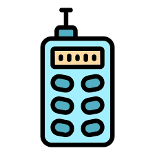

<!--
---

layout: home
permalink: index.html

# Please update this with your repository name and project title
repository-name: e21-3yp-Smart-Laser-Distance-Meter
title: Smart Laser Distance Meter
---
-->

# Smart Laser Distance Meter

  

---

## Team
-  E/21/065, CHAMOD S.A.R., [email](mailto:e21065@eng.pdn.ac.lk)
-  E/21/068, CHANDRASIRI E.M.D.D.V, [email](mailto:e21068@eng.pdn.ac.lk)
-  E/21/277, PADUKKA V.K., [email](mailto:e21277@eng.pdn.ac.lk)
-  E/21/325, RASHMIKA W.B.R., [email](mailto:e21325@eng.pdn.ac.lk) 

<!-- Image (photo/drawing of the final hardware) should be here -->

<!-- This is a sample image, to show how to add images to your page. To learn more options, please refer [this](https://projects.ce.pdn.ac.lk/docs/faq/how-to-add-an-image/) -->

<!--  -->

## Table of Contents
1. [Introduction](#introduction)
2. [Solution Architecture](#solution-architecture )
3. [Hardware & Software Designs](#hardware-and-software-designs)
4. [Testing](#testing)
5. [Detailed budget](#detailed-budget)
6. [Conclusion](#conclusion)
7. [Links](#links)

## Introduction

Accurate indoor measurement and floor plan creation are essential in construction, interior design, and architectural planning. Traditional manual measuring methods are time-consuming, error-prone, and require manual sketching.  

This project proposes a Smart Laser Distance Meter that integrates LiDAR-based distance sensing and inertial measurement to provide precise linear measurements, angle detection, and automatic area and volume calculations. The system further enables real-time 2D wall and floor plan generation, eliminating manual sketches and improving efficiency and accuracy.

## Solution Architecture

The system consists of a handheld embedded device and a mobile application. The embedded unit performs distance and orientation sensing, processes data using a microcontroller, and transmits results wirelessly to the mobile app.

**High-level flow:**
- LiDAR sensor measures distance
- IMU provides orientation and angle data
- ESP32 processes and filters data
- Bluetooth transfers data to mobile app
- Mobile app generates sketches and calculations

---

  

<!-- *(Insert architecture diagram here)*

High level diagram + description -->

## Hardware and Software Designs

### Hardware Design
- ESP32 CP2102 Type-C development board
- LiDAR DToF range finder (up to 20 m)
- MPU6050 IMU (3-axis accelerometer & gyroscope)
- 0.96" OLED display (I2C)
- Red line laser modules for alignment
- Buzzer and vibration motor for feedback
- 18650 battery with TP4056 charging module
- Custom PCB and 3D-printed enclosure

### Software Design
- Sensor interfacing and calibration
- Distance and angle computation
- Bluetooth communication protocol
- Mobile application for visualization, storage, and export

<!--
## Testing

Testing done on hardware and software, detailed + summarized results
 -->
## Detailed budget

### All items and costs

| Item          | Quantity  | Unit Cost  | Total  |
| ------------- |:---------:|:----------:|-------:|
| DTS6012M LiDAR Sensor  | 1  | 6000 LKR  | 6000 LKR |
| BNO055 9-Axis IMU Module | 1 | 4000 LKR | 4000 LKR |  
| ESP32 CP2102 Dev Board | 1 | 1500 LKR | 1500 LKR |
| Green Laser (5 mW) | 1 | 1500 LKR | 1500LKR |
| 18650 Li-ion Battery | 2 | 1400 LKR | 2800 LKR |
| 1.8" TFT LCD Display (MD0260) | 1 | 1000 LKR | 1000 LKR |
| TP4056 Charger + Boost conv. | 1 | 1000 LKR | 1000 LKR |
| Coin Vibration Motor | 1 | 200 LKR | 200 LKR |
| 2x18650 Batttery Holder | 1 | 150 LKR | 150 LKR |
| Active Buzzer | 1 | 100 LKR | 100 LKR |

<!--
## Conclusion

What was achieved, future developments, commercialization plans

-->
## Links

- [Project Repository](https://github.com/cepdnaclk/e21-3yp-Smart-Laser-Distance-Meter)
- [Project Page](https://cepdnaclk.github.io/e21-3yp-Smart-Laser-Distance-Meter)
- [Department of Computer Engineering](http://www.ce.pdn.ac.lk/)
- [University of Peradeniya](https://eng.pdn.ac.lk/)

[//]: # (Please refer this to learn more about Markdown syntax)
[//]: # (https://github.com/adam-p/markdown-here/wiki/Markdown-Cheatsheet)
